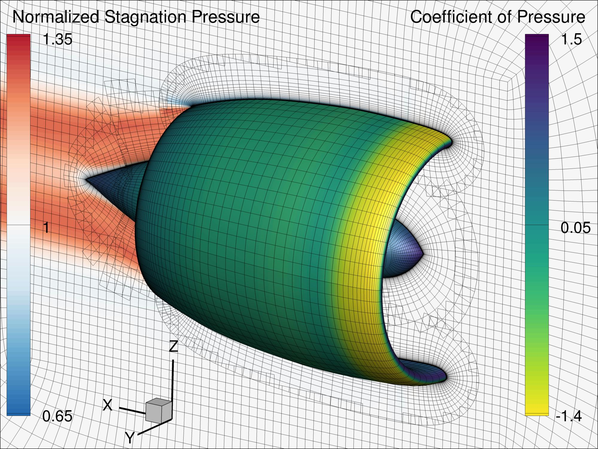

# Coupled Aeropropulsive Optimization of a Podded Propulsor

Airframe and propulsion system are designed simultaneously via aeropropulsive optimization utilising physics-based models.
When design experience is limited, coupled models help to reduce uncertainty in new concepts by capturing complex interactions between disciplines that are typically overlooked by sequential design methodologies.
An effective and reliable approach to managing these design problems is required for the emerging field of multidisciplinary optimisation of coupled aeropropulsive models.
Two fully-coupled CFD-based aeropropulsive design optimisation techniques, which are compatible with various propulsion modelling types in CFD solvers, are presented in this work to resolve these problems.
To optimize the aeropropulsive design, Gray et al (2020) developed a gradient-based aeropropulsive design optimization approach, which was further improved by the current authors (Yildirim et al (2019), Yildirim et al (2021)), to study the benefit of BLI to the STARC-ABL concept (Welstead et al (2016), Welstead (2017)).

The project provides two coupling methods for high-fidelity aerodynamics models and low-fidelity propulsion models.
We provide two coupling models for the fan, actuator zone (AZ) and boundary conditions (BC), to model the fan of the propulsor.
We use OpenMDAO to couple these two disciplines using the MPhys library. 
For aerodynamics, we use ADflow (RANS-based solver) with an efficient discrete adjoint implementation.
We use pyCycle to model the propulsion system.
We provide the required scripts and source files to perform a single-point optimization with both AZ and BC models.



## Prerequisites

Before you begin, ensure you have met the following requirements:
- You have installed the latest version of Mach--Aero packages, OpenMDAO, MPhys and pyCycle. Mach--Aero can also be used through Docker images.
- For parameterization, we use OpenVSP in this problem.

The links for the required packages are provided below:

| Packages  | Links                                                                   |
| --------- | ----------------------------------------------------------------------- |
| Mach-Aero | [Mach-Aero](https://mdolab-mach-aero.readthedocs-hosted.com/en/latest/) |
| OpenMDAO  | [OpenMDAO](https://openmdao.org/newdocs/versions/latest/main.html)      |
| MPhys     | [MPhys](https://openmdao.github.io/mphys/)                              |
| pyCycle   | [pyCycle](https://github.com/OpenMDAO/pyCycle)                          |
| OpenVSP   | [OpenVSP](https://openvsp.org/wiki/doku.php?id=ubuntu_instructions)     |

## Getting Started/ Acquiring Source Files

A quick introduction of the minimal setup you need to get the source files up & running after installing the required packages.
The mesh and reuqired input files are stored in University of Michigan's AFS system. Please follow the below steps to get sources files and input files.

Clone the source repo first:

```shell
git clone https://github.com/mdolab/aeroprop.git
cd aeroprop/run
```
Download the input files from the Umich AFS system (if the shell file is not executable, run this command: ``chmod +x get-input-files.sh``) :

```shell
./get-input-files.sh
```

Now, you have all the required scripts and input files to run the optimization. The following command is an example optimization setup for a FPR of ``1.3`` at the fully-body net thrust of ``12 kN`` (``2 x 6 kN``). Please run the command to perform an optimization:

```shell
mpirun -np 4 python aeroprop_run.py --task opt --level L2 --model az --thrust 6000 --fpr 1.300 --msl 0.1 --driver snopt --timelimit 34200.0 --output_dir ./OUTPUT/opt
```

# Citing this work

 **Please cite our work if you are using these models and sources:** 

```
@article{AbdulKaiyoom2024,
    author = {Mohamed Arshath Saja Abdul-Kaiyoom, Andrew H. R. Lamkin, Anil Yildirim and Charles A. Mader and Justin S. Gray and Joaquim R. R. A. Martins},
    title = {Coupled Aeropropulsive Design Optimization of a Podded Electric Propulsor (In Review)}
    journal = {Structural and Multidisciplinary Optimization},
    keywords = {atuator zone, boundary conditions, coupled aeropropulsion, podded propulsor},
    year = {2024},
    doi = {},
    issn = {},
    pages = {}
}
```


# References


```
@article{Gray2020a,
  author   = {Justin S. Gray and Charles A. Mader and Gaetan K. W. Kenway and Joaquim R. R. A. Martins},
  title    = {Coupled Aeropropulsive Design Optimization of a Three-Dimensional {BLI} Propulsor Considering Inlet Distortion},
  doi      = {10.2514/1.C035845},
  journal  = {Journal of Aircraft},
  keywords = {ank, aeroprop},
  month    = {November},
  number   = {6},
  pages    = {1014--1025},
  volume   = {57},
  year     = {2020},
  abstract = {Boundary-layer ingestion (BLI) promises increased aircraft efficiency, but excessive inlet distortion must be avoided to prevent fans that are too heavy or structurally infeasible. We propose a new approach to study the effect of distortion on BLI propulsors via an aeropropulsive design optimization with a constraint on inlet distortion using highly efficient gradient-based methods with analytic derivatives. The fully coupled aeropropulsive model includes a three-dimensional Reynolds-averaged Navier--Stokes aerodynamic analysis of the flow and a thermodynamic cycle model of the propulsor fan. We minimize the shaft power required at cruise for the aft BLI thruster by varying the propulsor size and the shape of the propulsor nacelle and aft fuselage. Optimizations are performed with and without the inlet distortion constraint for different aft-propulsor sizes to study the impact of the constraint on overall BLI performance. The results show that imposing a distortion
              constraint increased the required propulsor shaft power by up to 1.2\% relative to the unconstrained case, and that smaller propulsors suffer lower performance degradation than larger ones. The results underline the importance of using a fully coupled aeropropulsive model to predict BLI performance and demonstrate the power of aeropropulsive optimization in the design of BLI configurations.}
}

@inproceedings{Yildirim2019a,
  author    = {Anil Yildirim and Justin S. Gray and Charles A. Mader and Joaquim R. R. A. Martins},
  title     = {Aeropropulsive Design Optimization of a Boundary Layer Ingestion System},
  address   = {Dallas, TX},
  booktitle = {AIAA Aviation Forum},
  doi       = {10.2514/6.2019-3455},
  keywords  = {xsede, ank, aeroprop, beststudentpaper, openmdao},
  month     = {June},
  year      = {2019}
}

@inproceedings{Yildirim2021a,
  author    = {Anil Yildirim and Justin S. Gray and Charles A. Mader and Joaquim R. R. A. Martins},
  title     = {Performance Analysis of Optimized {STARC-ABL} Designs Across the Entire Mission Profile},
  booktitle = {Proceedings of the AIAA SciTech Forum},
  doi       = {10.2514/6.2021-0891},
  keywords  = {ank, aeroprop, openmdao},
  month     = {January},
  year      = {2021},
  abstract  = {Boundary layer ingestion (BLI) offers the potential for significant fuel burn reduction by exploiting strong aeropropulsive interactions. NASA's STARC-ABL concept uses an electrically powered BLI tail cone thruster on what is otherwise a conventional airframe. Despite this conventional airframe, aeropropulsive integration is critical to the performance of the BLI propulsor. In particular, the aeropropulsive integration of the BLI system must account for the variation in fan performance. Because it is electrically powered, the fan pressure ratio and efficiency of the BLI tail cone thruster vary widely across the flight envelope. Thus, accurate performance prediction for this novel propulsion configuration requires using a coupled aeropropulsive model across the flight envelope. In this work, we introduce a method to quantify the benefit of BLI at off-design conditions. We analyze the off-design performance of 18 optimized designs using an aeropropulsive model that is
               built with the OpenMDAO framework to couple 3-D RANS CFD simulations to 1-D thermodynamic cycle analyses. The designs are generated via high-fidelity aeropropulsive design optimizations for a range of fan pressure ratio and thrust values at the cruise conditions for the STARC-ABL concept. Performance analyses are then performed at a range of off-design flight conditions that span the flight envelope, including low-speed and low-altitude flight conditions. This study provides the first set of high-fidelity data for the STARC--ABL configuration at off-design conditions. The results quantify the power savings through BLI compared to a traditional propulsion system across the entire mission profile. Finally, the results and techniques from this study will guide the extension of current aeropropulsive design capabilities to multipoint design optimizations.}
}

@inproceedings{Welstead2016a,
  author    = {Welstead, Jason and Felder, James L.},
  title     = {Conceptual {Design} of a {Single}-{Aisle} {Turboelectric} {Commercial} {Transport} with {Fuselage} {Boundary} {Layer} {Ingestion}},
  booktitle = {54th {AIAA} {Aerospace} {Sciences} {Meeting}},
  doi       = {10.2514/6.2016-1027},
  month     = {January},
  publisher = {American Institute of Aeronautics and Astronautics},
  series    = {{AIAA} {SciTech} {Forum}},
  year      = {2016}
}

@misc{Welstead2017a,
  author   = {Welstead, Jason Felder},
  title    = {Overview of the {NASA} {STARC}-{ABL} (Rev. {B}) Advanced Concept},
  keywords = {aerodynamic configurations, aircraft engines, boundary layers, electric propulsion, propulsion system configurations, propulsion system performance, shafts, systems analysis, systems engineering, turbofan engines, turbogenerators},
  month    = {March},
  url      = {https://ntrs.nasa.gov/citations/20170005612},
  year     = {2017},
  abstract = {No abstract available}
}
```

# License

Copyright 2024 MDO Lab

The files associated with this dataset are licensed under a Creative Commons Attribution 4.0 International licence at

https://creativecommons.org/licenses/by/4.0/

## what does this mean?

You can share, copy and modify this dataset so long as you give appropriate credit, provide a link to the CC BY license, and indicate if changes were made, but you may not do so in a way that suggests the rights holder has endorsed you or your use of the dataset. Note that further permission may be required for any content within the dataset that is identified as belonging to a third party.
